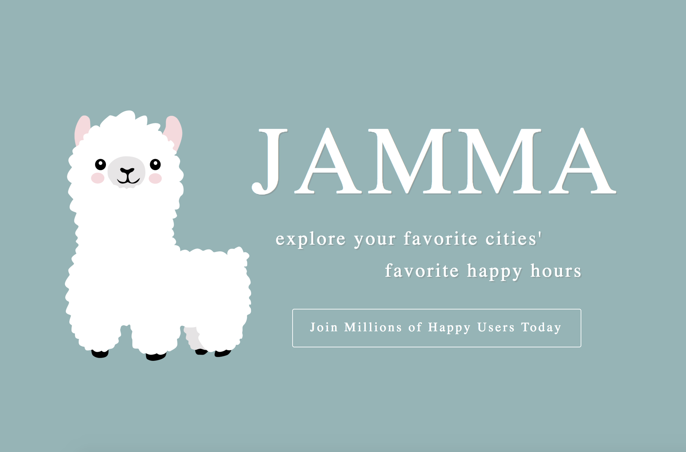

# Production README

Live site: [Jamma](https://jamma-llama.herokuapp.com)

Jamma is a single-page web application that displays happy hour pins on a map using Google Maps API. Clicking on pins bring happy hour information on a modal. It's built with MongoDB, Express.js, React.js, and Node.js. 



# Feature and Implementation
### Happy Hour viewing

Users can login and browse through the map to find/get information about different happy hours. 


### Adding Happy Hour

Users can share their own happy hour information and add a pin to the map.


### Removing Happy Hour

Users can remove happy hours they've added by clicking Remove button on the happy hour modal.

For this feature, we made sure to reset the pins each time a happy hour is removed so that changes could be reflected in real time.

```javascript
componentDidUpdate(prevProps) {
    if (prevProps.businesses.length > this.props.businesses.length) {
        const mapOptions = {
            center: {
                lat: 37.7758,
                lng: -122.435
            },
            zoom: 13,
            styles: styleOptions
        }
        this.map = new window.google.maps.Map(this.mapNode, mapOptions);
        this.infoWindow = new window.google.maps.InfoWindow;
        this.listenForMove();
        let that = this;

        this.addHappyHour();
    }
}
```

